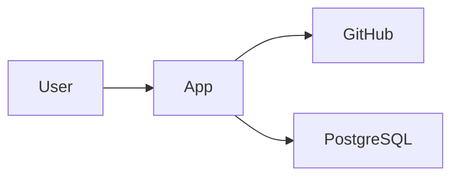

# System Builder – Arkitekturbeskrivning

## 1. Syfte

`docs/architecture.md` är canonical current-state-beskrivning av **hur systemet övergripande är strukturerat för att uppfylla krav och kvalitetsmål**.

Dokumentet ska vara:

- människoläsbart,
- tillräckligt konkret för utvecklingsplanering,
- stabilt över tid,
- fokuserat på ansvar, gränser, dataflöden och viktiga tekniska val,
- uppdaterat efter förändringar som påverkar systemets arkitektur.

Det ska inte vara:

- en fil-för-fil-beskrivning,
- full detaljdesign,
- en katalog över alla dependencies,
- en historisk beslutslogg,
- en deploymentmanual,
- en implementation plan.

## 2. Grundprincip

> Arkitekturen beskriver systemets huvudstruktur, ansvar och viktigaste tekniska egenskaper – inte varje implementation detail.

System Builder ska skilja på:

- **funktionell spec** – vad systemet ska göra,
- **arkitektur** – hur ansvar och huvudkomponenter organiseras,
- **ADR** – varför ett viktigt beslut togs,
- **development plan** – i vilken ordning lösningen byggs,
- **implementation** – konkret kod och konfiguration.

## 3. När dokumentet ska finnas

### CREATE

Arkitekturen ska normalt definieras innan bred implementation börjar.

För små projekt får den vara kompakt men ska minst täcka:

- system context,
- huvudkomponenter,
- data/persistence,
- viktiga integrationer,
- security baseline,
- deploymentmodell,
- viktiga tekniska val.

### CHANGE

Befintlig arkitektur ska läsas innan ändringen planeras.

Om change request påverkar:

- komponentgränser,
- dataägarskap,
- integrationer,
- auth/security,
- deployment,
- större teknikval,
- persistence,
- operability,

ska architecture impact analyseras och current-state-arkitekturen uppdateras när förändringen är klar.

### IMPROVE

Ren lokal refaktorering behöver normalt inte ändra architecture.md om systemets övergripande ansvar och struktur är oförändrade.

## 4. Rekommenderad struktur

```text
# Architecture

## 1. Architecture goals
## 2. System context
## 3. Main components
## 4. Responsibilities and boundaries
## 5. Key data flows
## 6. Data model and ownership
## 7. Integrations
## 8. Security architecture
## 9. Deployment model
## 10. Observability and operability
## 11. Key technology choices
## 12. Trade-offs and constraints
## 13. Architecture decisions / ADRs
## 14. Open architecture questions
```

Strukturen får förenklas för små projekt och utökas när projektets risk eller komplexitet kräver det.

## 5. Architecture goals

Beskriv de kvaliteter arkitekturen främst ska stödja.

Exempel:

- enkel drift,
- låg förändringskostnad,
- tydlig separation mellan UI och domänlogik,
- stateless applikation,
- extern PostgreSQL,
- säker integration med tredjepartssystem.

Målen ska kunna härledas från funktionella/NFR-krav, projektkontext eller deploymentmål.

Undvik att lista generella kvalitetsord utan konsekvens.

## 6. System context

Beskriv systemet som helhet och dess omgivning.

Minst när relevant:

- användare/aktörer,
- externa system,
- inbound/outbound integrations,
- primära trust boundaries,
- viktiga datautbyten.

Detta kan uttryckas i text eller enkel Mermaid när det förbättrar förståelsen.

Exempel:



Diagram ska stödja texten, inte ersätta nödvändiga förklaringar.

## 7. Main components

Identifiera huvudkomponenter på en stabil nivå.

Exempel:

- Web UI,
- Backend API,
- Domain/Application services,
- Persistence adapter,
- GitHub integration,
- Background worker,
- PostgreSQL.

Komponenter ska ha tydliga ansvar.

Undvik artificiell uppdelning bara för att skapa "ren arkitektur".

## 8. Responsibilities and boundaries

För varje huvudkomponent bör det vara tydligt:

- vad den ansvarar för,
- vad den inte ansvarar för,
- vilka beroenden den får ha,
- vilket data/ägarskap den har.

Bra:

> Backend API ansvarar för autentiserade applikationsflöden och orkestrering men inte för GitHub-specifika HTTP-detaljer, som kapslas i integrationsadaptern.

Svagt:

> Backend hanterar backendlogik.

## 9. Key data flows

Beskriv viktiga end-to-end-flöden som påverkar arkitekturen.

Exempel:

```text
User
→ Web UI
→ Backend API
→ GitHub Adapter
→ GitHub API
```

För stateful flöden bör persistence och transaction boundaries beskrivas på hög nivå.

## 10. Data model and ownership

Beskriv:

- centrala informationsobjekt,
- vem som äger data,
- var data persistenteras,
- viktiga relationer,
- migrations-/retentionsprinciper när relevanta.

Detta är konceptuell/logisk nivå.

Detaljerade tabellkolumner hör normalt inte hemma här om de inte är avgörande för designen.

## 11. Integrations

För varje viktig integration bör arkitekturen beskriva:

- syfte,
- ansvar,
- riktning,
- synkron/asynkron karaktär,
- autentisering på hög nivå,
- retry/idempotency när relevant,
- felhantering/fallback,
- timeout/circuit-breaker-behov när relevant.

Library- eller SDK-versioner hör normalt till implementation/dependency management om de inte driver ett arkitekturbeslut.

## 12. Security architecture

Beskriv säkerhetsprinciper på systemnivå.

Minst när relevant:

- authentication,
- authorization,
- trust boundaries,
- secrets,
- sensitive data,
- validation,
- audit/logging,
- external access,
- dependency/security controls,
- backup/restore responsibility.

Detaljerad threat model eller full security review krävs bara när risknivån motiverar det eller specialistgranskning efterfrågas.

## 13. Deployment model

Beskriv hur systemet är tänkt att köras.

Koppla till `.system-builder/deployment-profile.yaml` när den finns.

Beskriv minst när relevant:

- runtime components,
- container/non-container,
- stateless/stateful,
- database placement,
- persistent storage,
- reverse proxy,
- TLS ownership,
- configuration/secrets,
- health checks,
- scaling assumptions.

Exempel:

> Backend körs som stateless Docker-container i Coolify. PostgreSQL körs som extern database service och ingår inte i app-imagen. Reverse proxy och TLS hanteras av Coolify.

Maskinella deploymentval ska inte dupliceras i detalj från deployment-profile.yaml; architecture.md beskriver rationale och systemkonsekvenser.

## 14. Observability and operability

Beskriv vad som krävs för att förstå och driva systemet.

Minst när relevant:

- structured logs,
- health/readiness,
- metrics,
- tracing,
- error reporting,
- operational events,
- backup/restore,
- supportability.

Detta ska vara proportionerligt till projektets storlek.

## 15. Key technology choices

Dokumentera centrala teknikval som påverkar arkitekturen.

Exempel:

- React SPA,
- Quarkus REST backend,
- PostgreSQL,
- Docker,
- GitHub Actions.

För varje större val bör kort rationale finnas eller ADR-länk.

Små standardval behöver inte få eget ADR.

## 16. Trade-offs and constraints

Arkitektur ska tydligt beskriva viktiga kompromisser.

Exempel:

> Vi väljer en modulär monolit i första release eftersom teamet är litet och domänen ännu inte motiverar distribuerade tjänster. Detta minskar driftkomplexitet men innebär att skalning sker per applikation snarare än per domänkomponent.

Constraints kan vara:

- befintlig plattform,
- kostnadsram,
- deploymentmiljö,
- regulatoriska krav,
- kompetens,
- legacy-integration,
- latency.

## 17. Architecture Decision Records

Betydande beslut ska kunna få ADR.

Exempel:

- `ADR-001-use-postgresql.md`
- `ADR-002-run-on-coolify.md`

Architecture.md beskriver current state.

ADR beskriver beslutets historik/rationale.

Om ett ADR ersätts ska architecture.md uppdateras till aktuellt läge.

## 18. Open architecture questions

Öppna frågor klassificeras som:

- **blocking**
- **non-blocking**

Exempel:

> Blocking: Ska filstorage vara persistent volume eller objektlagring?

System Builder ska inte börja implementation som bygger på ett obesvarat arkitekturbeslut om valet materially påverkar dataförlust, säkerhet eller svår migrationskostnad.

## 19. Kvalitetskriterier

En arkitekturbeskrivning är tillräckligt bra när:

1. systemets context och externa beroenden är begripliga,
2. huvudkomponenter och ansvar är tydliga,
3. viktiga dataflöden är förståeliga,
4. dataägarskap/persistence är tillräckligt definierat,
5. security baseline är synlig,
6. deploymentmodellen är tydlig,
7. operability har beaktats,
8. viktiga teknikval har rationale,
9. stora trade-offs är explicita,
10. blockerande arkitekturfrågor är synliga,
11. dokumentet beskriver current state.

## 20. Anti-patterns

### Arkitektur som filinventering

Dåligt:

> `UserService.java` anropar `RepositoryService.java`.

Bra:

> Application service ansvarar för användarflödet och använder persistence-porten för lagring.

### Överdesign

Inför inte:

- event bus,
- microservices,
- CQRS,
- interfaces,
- hexagonal architecture,

bara för att mönstret finns.

Valet ska lösa ett verkligt problem eller skapa tydlig framtida nytta.

### Diagram utan semantik

Ett diagram med tio boxar utan ansvarsförklaring är inte en arkitekturbeskrivning.

### Implementation details som låser planen

Undvik fullständiga klassnamn, metodsignaturer och filpaths om de inte är arkitekturellt viktiga.

### Historik i current state

Architecture.md ska säga vad arkitekturen **är**, inte kronologiskt återberätta alla tidigare varianter.

## 21. CREATE-regel

Vid CREATE:

1. härled arkitekturmål från spec, risk och deployment,
2. definiera minsta arkitektur som stöder must-scope,
3. undvik premature scaling/overdesign,
4. dokumentera viktiga trade-offs,
5. identifiera ADR-behov,
6. säkerställ att planen kan brytas ned i verifierbara steg.

## 22. CHANGE-regel

Vid CHANGE:

1. läs current architecture,
2. identifiera affected components/boundaries/data/deployment,
3. gör impact analysis,
4. avgör om ändringen är lokal eller arkitekturell,
5. skapa ADR om ett betydande beslut tas,
6. uppdatera architecture.md till nytt current state när förändringen genomförs.

Ett change-dokument får inte bli enda platsen där den nya arkitekturen beskrivs.

## 23. IMPROVE-regel

Vid IMPROVE:

- ändra architecture.md bara om systemets övergripande struktur, ansvar eller viktiga teknikval faktiskt förändras,
- beteendebevarande lokal refaktorering ska inte skapa falsk arkitekturförändring.

## 24. Small-project-regel

För small-projekt får dokumentet komprimeras till:

```text
# Architecture

## Goals
## System context
## Components and responsibilities
## Data and integrations
## Security
## Deployment
## Key decisions / trade-offs
## Open questions
```

Tomma sektioner ska undvikas.

## 25. Relation till deployment profile

När `.system-builder/deployment-profile.yaml` finns:

- YAML är canonical för strukturerade deploymentval,
- architecture.md beskriver hur deploymentvalet påverkar systemdesignen,
- installation.md beskriver installation,
- operations.md beskriver drift.

Vid konflikt mellan dokumenten ska System Builder identifiera konflikten och reparera den från definierad canonical källa, inte gissa.

## 26. Exit-kriterier för architecture-fasen

Fasen är klar när:

- huvudkomponenter och ansvar är tillräckligt definierade för planering,
- data/persistence och integrationsgränser är begripliga,
- security/deployment är tillräckligt tydliga,
- viktiga trade-offs är dokumenterade,
- blockerande frågor är lösta eller explicit blockerar nästa steg,
- arkitekturen är tillräckligt liten för projektets verkliga behov.
