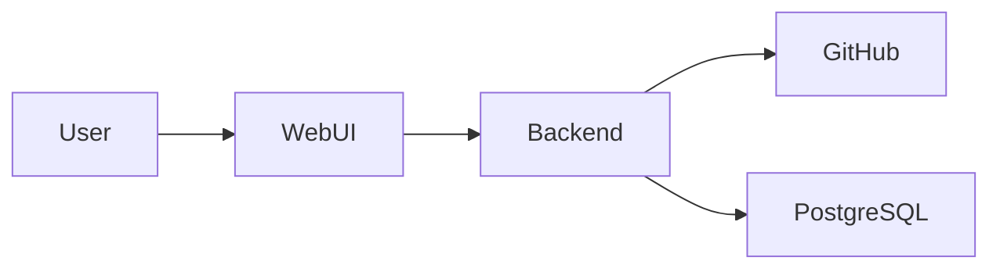

# Architecture – Example ZIP-to-GitHub Service

## 1. Architecture goals

- hålla applikationen enkel att drifta,
- kunna köra stateless i container,
- separera GitHub-specifik integration från kärnflödet,
- förhindra osäker ZIP-hantering,
- använda extern PostgreSQL vid behov av persistent metadata.

## 2. System context

Användaren laddar upp en projekt-ZIP via web UI. Backend validerar ZIP-filen, orkestrerar repository-skapandet och kommunicerar med GitHub.



## 3. Main components

### Web UI

**Responsibility:** Samla in ZIP, repositoryinställningar och visa resultat.  
**Does not own:** GitHub API-logik eller ZIP-extraktion.

### Backend API

**Responsibility:** Autentiserade applikationsflöden och orkestrering.  
**Does not own:** GitHub HTTP-detaljer eller persistent datalagringsimplementation.

### ZIP validation component

**Responsibility:** Validera archive paths och säker extraktion.

### GitHub adapter

**Responsibility:** Kapsla GitHub API-anrop och integrationsspecifik felhantering.

### Persistence adapter

**Responsibility:** Lagra eventuell projekthistorik och operation state i PostgreSQL.

## 4. Responsibilities and boundaries

Backend får bero på ZIP validation, GitHub adapter och persistence adapter genom tydliga applikationsgränser. Web UI får inte anropa GitHub direkt.

## 5. Key data flows

### Create repository

```text
User
→ Web UI
→ Backend API
→ ZIP validation
→ GitHub adapter
→ GitHub API
→ Backend API
→ Web UI
```

Metadata om operationen kan lagras i PostgreSQL när sådan historik behövs.

## 6. Data model and ownership

Centrala koncept:

- User
- Import request
- Repository target
- Operation result

GitHub är source of truth för själva repositoryt. Applikationsdatabasen äger endast lokalt workflow-/historikstate.

## 7. Integrations

### GitHub

**Purpose:** Skapa repository och skriva projektfiler.  
**Direction:** Backend → GitHub.  
**Failure handling:** Backend ska kunna skilja på failure före repository creation och partiellt failure efter creation.

## 8. Security architecture

- användaren autentiseras innan GitHub-operationer,
- GitHub credentials/tokens behandlas som secrets,
- ZIP valideras före extraktion,
- backend ska inte lita på filpaths från archive,
- loggar ska inte innehålla credentials.

## 9. Deployment model

Backend körs som stateless Docker-container. PostgreSQL körs externt och ingår inte i app-imagen. Reverse proxy och TLS hanteras av målplattformen. Health endpoints exponeras för liveness/readiness.

## 10. Observability and operability

- strukturerade applikationsloggar,
- health endpoint,
- tydliga felkoder för integrationsfel,
- operation identifier för felsökning.

## 11. Key technology choices

| Choice | Rationale | ADR |
|---|---|---|
| Modular monolith | Minimerar driftkomplexitet för första release | ADR-001 candidate |
| External PostgreSQL | Separerar persistence från app runtime | - |
| Docker packaging | Portabel och kompatibel med Coolify/containerplattform | - |

## 12. Trade-offs and constraints

En modulär monolit ger enklare deployment men delarna kan inte skalas oberoende. Detta accepteras eftersom första release har begränsad trafik och ett litet team.

## 13. Architecture decisions / ADRs

- ADR-001 bör skapas om modular-monolith-valet behöver långsiktig historik.

## 14. Open architecture questions

### Blocking

- None.

### Non-blocking

- Om lokalt operation state behövs i första release eller kan skjutas till senare.
