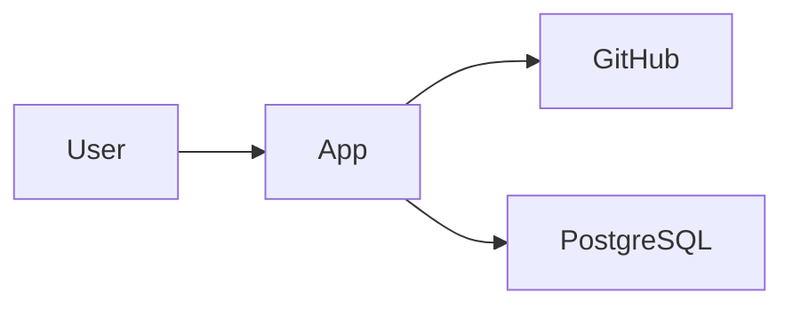

# System Builder Knowledge Bundle

Class: reference

---

## Source: `docs/functional-specification-standard.md`

# System Builder – Funktionell specifikation

## 1. Syfte

`docs/functional-specification.md` är canonical current-state-beskrivning av **vad systemet ska göra**.

Dokumentet ska vara:

- människoläsbart,
- tillräckligt precist för arkitektur och utvecklingsplanering,
- verifierbart,
- stabilt över tid,
- uppdaterat efter genomförda funktionella förändringar.

Det ska inte vara:

- en implementation plan,
- en teknisk arkitekturbeskrivning,
- en historisk ändringslogg,
- en samling osorterade idéer.

## 2. Grundprincip

> Beskriv avsett beteende, regler, aktörer, information och acceptans utan att låsa implementation mer än nödvändigt.

System Builder ska skilja på:

- **behov** – varför något behövs,
- **funktionellt krav** – vad systemet ska kunna göra,
- **acceptance criterion** – hur vi avgör om kravet är uppfyllt,
- **design/implementation** – hur lösningen byggs.

## 3. När dokumentet ska finnas

### CREATE

Skapas innan bred implementation påbörjas.

För små projekt får det vara kompakt men ska minst täcka:

- syfte,
- scope,
- centrala aktörer/flöden,
- must-krav,
- centrala acceptance criteria,
- out of scope.

### CHANGE

Befintlig spec ska läsas och uppdateras om förändringen ändrar systemets avsedda beteende.

Större förändringar får ha en separat `docs/changes/CR-xxx-.../request.md`, men när ändringen är klar ska resultatet integreras i current-state-specen.

### IMPROVE

Ren teknisk förbättring behöver normalt inte ändra functional spec om avsett beteende är oförändrat.

## 4. Rekommenderad struktur

```text
# Funktionell specifikation

## 1. Syfte och mål
## 2. Scope
## 3. Aktörer
## 4. Centrala användningsfall
## 5. Funktionella krav
## 6. Affärsregler
## 7. Informationsbehov
## 8. Integrationer
## 9. Behörighet
## 10. Fel- och undantagsfall
## 11. Icke-funktionella krav
## 12. Acceptance criteria
## 13. Out of scope
## 14. Öppna frågor
```

Strukturen får förenklas för små projekt och utökas när domänen kräver det.

## 5. Syfte och mål

Beskriv:

- vilket problem systemet löser,
- för vem,
- vilket önskat resultat som ska uppnås,
- eventuella success criteria som är relevanta.

Undvik implementationstermer om de inte faktiskt är ett krav.

Dåligt:

> Systemet ska använda React och PostgreSQL för att ge användaren bättre överblick.

Bättre:

> Systemet ska ge användaren en samlad överblick över sina aktiva projekt och deras status.

Teknikval hör normalt hemma i arkitekturen.

## 6. Scope

Dela normalt upp i:

- **Must**
- **Should**
- **Could**
- **Out of scope**

Första release/MVP får definieras när det förbättrar tydligheten.

Scope ska göra det möjligt att säga nej till idéer som inte hör till aktuell leverans.

## 7. Aktörer

Identifiera externa roller som interagerar med systemet.

Exempel:

- administratör,
- registrerad användare,
- extern tjänst,
- batch/integrationssystem.

Beskriv aktörernas ansvar och rättigheter på verksamhetsnivå.

Tekniska komponenter ska inte listas som aktörer om de inte representerar ett externt system.

## 8. Centrala användningsfall

Beskriv de viktigaste end-to-end-flödena.

Varje use case bör normalt innehålla:

- namn,
- primär aktör,
- mål,
- preconditions när relevanta,
- huvudflöde,
- viktiga alternativ/undantag,
- resultat.

Undvik att beskriva varje knapptryckning om inte UI-beteendet är viktigt för kravet.

## 9. Funktionella krav

### 9.1 ID

Krav som behöver spårbarhet får stabila ID:n:

- `FR-001`
- `FR-002`

ID ska inte återanvändas för annan betydelse.

### 9.2 Form

Ett funktionellt krav ska:

- beskriva observerbart eller domänmässigt beteende,
- ha en tydlig aktör/systemtrigger när relevant,
- kunna kopplas till verifiering,
- undvika onödiga implementation details.

Bra:

> **FR-012 – Skapa repository**  
> En behörig användare ska kunna skapa ett nytt repository från en uppladdad projekt-ZIP.

Svagare:

> Backend ska anropa GitHub REST API med POST.

Det senare hör normalt till arkitektur/implementation.

### 9.3 Prioritet

Använd:

- `Must`
- `Should`
- `Could`

Out-of-scope uttrycks normalt inte som aktivt FR-krav.

### 9.4 Status

Specifikationen ska normalt inte använda runtime-status som `implemented` eller `verified`.

Sådan status hör hemma i `.system-builder/traceability.yaml` eller work state.

## 10. Affärsregler

Affärsregler är domänregler som gäller oberoende av UI eller implementation.

Exempel:

> **BR-001** Ett projekt får endast arkiveras av en användare med administratörsbehörighet.

Stabila ID:n används när regler behöver refereras från flera krav eller tester.

## 11. Informationsbehov

Beskriv vilken information systemet behöver hantera på konceptuell nivå.

Exempel:

- användare,
- projekt,
- repository,
- status,
- deploymentmiljö.

Här ska inte full fysisk databasschema-design göras.

## 12. Integrationer

Beskriv externa system ur ett funktionellt perspektiv:

- vilket system,
- vilket informations-/funktionsutbyte,
- riktning,
- kritiska fel-/fallback-situationer,
- eventuell användarsynlig påverkan.

Protokoll, SDK-versioner och klientbibliotek hör normalt hemma i arkitekturen.

## 13. Behörighet

Beskriv:

- vilka aktörer som får göra vad,
- ägarskap,
- synlighet,
- eventuella rollskillnader,
- vilka funktioner som kräver särskild behörighet.

Detaljerad auth-teknik hör till arkitektur.

## 14. Fel- och undantagsfall

Beskriv beteenden som är viktiga för användaren eller verksamhetsreglerna.

Exempel:

- extern integration är otillgänglig,
- uppladdad fil är ogiltig,
- objekt finns redan,
- användaren saknar behörighet,
- operation är delvis genomförd.

Felhantering ska inte bara beskrivas som "visa felmeddelande" om domänkonsekvenser finns.

## 15. Icke-funktionella krav

Använd `NFR-xxx` när spårbarhet behövs.

Vanliga områden:

- prestanda,
- tillgänglighet,
- säkerhet,
- tillgänglighet/accessibility,
- observability,
- datalagring,
- återställning,
- portability,
- driftbarhet.

Ett NFR ska vara så verifierbart som rimligt.

Svagt:

> Systemet ska vara snabbt.

Bättre:

> **NFR-003** För normala listvyer ska 95 % av serveranropen slutföras inom 500 ms vid upp till 100 samtidiga användare i avsedd produktionsmiljö.

Exakta nivåer ska inte hittas på utan användarstöd eller tydlig projektgrund.

## 16. Acceptance criteria

Acceptance criteria beskriver hur det avgörs att ett krav eller use case fungerar som avsett.

Stabila ID:n:

- `AC-001`
- `AC-002`

Ett AC ska normalt vara:

- konkret,
- observerbart,
- verifierbart,
- kopplat till ett eller flera krav.

Exempel:

> **AC-021** När en behörig användare laddar upp en giltig projekt-ZIP och väljer "Skapa repository" ska repositoryt skapas och användaren få en länk till det skapade repositoryt.

Undvik att acceptance criteria bara återupprepar kravtext ordagrant.

## 17. Out of scope

Out of scope ska vara explicit där det finns realistisk risk för missförstånd.

Exempel:

- ingen multi-tenancy i första release,
- ingen mobilapp,
- ingen automatisk produktionsdeployment,
- ingen import från annan leverantör.

Detta skyddar development plan mot scope creep.

## 18. Öppna frågor

Öppna frågor ska klassificeras som:

- **blocking** – måste lösas innan relevant implementation,
- **non-blocking** – kan lösas senare.

System Builder ska inte fortsätta genom en blocking fråga som materiellt gör design eller verifiering osäker.

## 19. Kvalitetskriterier

En funktionell specifikation är tillräckligt bra när:

1. problem och mål är begripliga,
2. must-scope är tydlig,
3. aktörer och huvudflöden är identifierade,
4. centrala krav är observerbara/verifierbara,
5. implementation details är begränsade till verkliga krav,
6. affärsregler och behörighet är synliga när relevanta,
7. viktiga fel-/undantagsfall finns,
8. centrala acceptance criteria finns,
9. out-of-scope är explicit där relevant,
10. blockerande öppna frågor är synliga,
11. dokumentet beskriver current state och inte bara förändringshistorik.

## 20. Anti-patterns

System Builder ska undvika:

### Teknisk lösning förklädd till krav

> "Använd Kafka för events."

om det egentliga behovet är:

> "Händelser ska kunna levereras asynkront mellan delsystem."

### Vaga kvalitetsord

> snabbt, säkert, intuitivt, skalbart

utan konkret innebörd.

### Krav som inte går att avgöra

> Systemet ska vara användarvänligt.

### Fullständig UI-detaljering för tidigt

Beskriv beteende och informationsbehov först. Pixel- och komponentdesign hör bara hemma här om den är en del av själva kravet.

### Dubbletter

Samma krav ska inte finnas i flera avsnitt med olika formulering.

### Historik i current state

> "Tidigare gjorde systemet X men från version 2 gör det Y."

Detta hör i change history/decision record om historiken behöver bevaras. Current spec ska beskriva Y.

## 21. CREATE-regel

Vid CREATE:

1. börja från behov/discovery,
2. skapa en första sammanhängande spec,
3. markera blockerande frågor,
4. undvik att implementera innan must-scope och första planeringsunderlaget är tillräckligt stabilt,
5. revidera specen när legitima beslut tas.

## 22. CHANGE-regel

Vid CHANGE:

1. läs befintlig spec och faktisk kod,
2. identifiera vilka FR/NFR/use cases som påverkas,
3. dokumentera förändringsbehov och impact,
4. uppdatera current-state-specen när den avsedda funktionen ändras,
5. bevara större historik i change request vid behov,
6. uppdatera traceability för påverkade stabila ID:n.

Ändra inte ett befintligt krav-ID:s innebörd så drastiskt att spårbarheten blir missvisande. Skapa då nytt krav och markera det gamla som ersatt i historiken.

## 23. Small-project-regel

För small-projekt får strukturen komprimeras till exempelvis:

```text
# Functional Specification

## Purpose
## Scope
## Actors and main flows
## Functional requirements
## Acceptance criteria
## Out of scope
## Open questions
```

Kvalitetsreglerna gäller fortfarande.

Tomma sektioner ska inte skapas bara för mallens skull.

## 24. Traceability

När `.system-builder/traceability.yaml` används:

- full kravtext finns endast i Markdown,
- YAML refererar stabila krav-ID:n,
- `must`-krav ska kunna följas till development steps och verifiering,
- orphan requirements ska kunna identifieras.

## 25. Exit-kriterier för functional-specification-fasen

Fasen är klar när:

- must-funktionaliteten är tillräckligt definierad för arkitektur och planering,
- centrala acceptance criteria finns,
- blockerande frågor är lösta eller explicit blockerar nästa fas,
- specen är current-state och internkonsekvent,
- krav som kräver spårbarhet har stabila ID:n.

---

## Source: `docs/architecture-standard.md`

# System Builder – Arkitekturbeskrivning

## 1. Syfte

`docs/architecture.md` är canonical current-state-beskrivning av **hur systemet övergripande är strukturerat för att uppfylla krav och kvalitetsmål**.

Dokumentet ska vara:

- människoläsbart,
- tillräckligt konkret för utvecklingsplanering,
- stabilt över tid,
- fokuserat på ansvar, gränser, dataflöden och viktiga tekniska val,
- uppdaterat efter förändringar som påverkar systemets arkitektur.

Det ska inte vara:

- en fil-för-fil-beskrivning,
- full detaljdesign,
- en katalog över alla dependencies,
- en historisk beslutslogg,
- en deploymentmanual,
- en implementation plan.

## 2. Grundprincip

> Arkitekturen beskriver systemets huvudstruktur, ansvar och viktigaste tekniska egenskaper – inte varje implementation detail.

System Builder ska skilja på:

- **funktionell spec** – vad systemet ska göra,
- **arkitektur** – hur ansvar och huvudkomponenter organiseras,
- **ADR** – varför ett viktigt beslut togs,
- **development plan** – i vilken ordning lösningen byggs,
- **implementation** – konkret kod och konfiguration.

## 3. När dokumentet ska finnas

### CREATE

Arkitekturen ska normalt definieras innan bred implementation börjar.

För små projekt får den vara kompakt men ska minst täcka:

- system context,
- huvudkomponenter,
- data/persistence,
- viktiga integrationer,
- security baseline,
- deploymentmodell,
- viktiga tekniska val.

### CHANGE

Befintlig arkitektur ska läsas innan ändringen planeras.

Om change request påverkar:

- komponentgränser,
- dataägarskap,
- integrationer,
- auth/security,
- deployment,
- större teknikval,
- persistence,
- operability,

ska architecture impact analyseras och current-state-arkitekturen uppdateras när förändringen är klar.

### IMPROVE

Ren lokal refaktorering behöver normalt inte ändra architecture.md om systemets övergripande ansvar och struktur är oförändrade.

## 4. Rekommenderad struktur

```text
# Architecture

## 1. Architecture goals
## 2. System context
## 3. Main components
## 4. Responsibilities and boundaries
## 5. Key data flows
## 6. Data model and ownership
## 7. Integrations
## 8. Security architecture
## 9. Deployment model
## 10. Observability and operability
## 11. Key technology choices
## 12. Trade-offs and constraints
## 13. Architecture decisions / ADRs
## 14. Open architecture questions
```

Strukturen får förenklas för små projekt och utökas när projektets risk eller komplexitet kräver det.

## 5. Architecture goals

Beskriv de kvaliteter arkitekturen främst ska stödja.

Exempel:

- enkel drift,
- låg förändringskostnad,
- tydlig separation mellan UI och domänlogik,
- stateless applikation,
- extern PostgreSQL,
- säker integration med tredjepartssystem.

Målen ska kunna härledas från funktionella/NFR-krav, projektkontext eller deploymentmål.

Undvik att lista generella kvalitetsord utan konsekvens.

## 6. System context

Beskriv systemet som helhet och dess omgivning.

Minst när relevant:

- användare/aktörer,
- externa system,
- inbound/outbound integrations,
- primära trust boundaries,
- viktiga datautbyten.

Detta kan uttryckas i text eller enkel Mermaid när det förbättrar förståelsen.

Exempel:



Diagram ska stödja texten, inte ersätta nödvändiga förklaringar.

## 7. Main components

Identifiera huvudkomponenter på en stabil nivå.

Exempel:

- Web UI,
- Backend API,
- Domain/Application services,
- Persistence adapter,
- GitHub integration,
- Background worker,
- PostgreSQL.

Komponenter ska ha tydliga ansvar.

Undvik artificiell uppdelning bara för att skapa "ren arkitektur".

## 8. Responsibilities and boundaries

För varje huvudkomponent bör det vara tydligt:

- vad den ansvarar för,
- vad den inte ansvarar för,
- vilka beroenden den får ha,
- vilket data/ägarskap den har.

Bra:

> Backend API ansvarar för autentiserade applikationsflöden och orkestrering men inte för GitHub-specifika HTTP-detaljer, som kapslas i integrationsadaptern.

Svagt:

> Backend hanterar backendlogik.

## 9. Key data flows

Beskriv viktiga end-to-end-flöden som påverkar arkitekturen.

Exempel:

```text
User
→ Web UI
→ Backend API
→ GitHub Adapter
→ GitHub API
```

För stateful flöden bör persistence och transaction boundaries beskrivas på hög nivå.

## 10. Data model and ownership

Beskriv:

- centrala informationsobjekt,
- vem som äger data,
- var data persistenteras,
- viktiga relationer,
- migrations-/retentionsprinciper när relevanta.

Detta är konceptuell/logisk nivå.

Detaljerade tabellkolumner hör normalt inte hemma här om de inte är avgörande för designen.

## 11. Integrations

För varje viktig integration bör arkitekturen beskriva:

- syfte,
- ansvar,
- riktning,
- synkron/asynkron karaktär,
- autentisering på hög nivå,
- retry/idempotency när relevant,
- felhantering/fallback,
- timeout/circuit-breaker-behov när relevant.

Library- eller SDK-versioner hör normalt till implementation/dependency management om de inte driver ett arkitekturbeslut.

## 12. Security architecture

Beskriv säkerhetsprinciper på systemnivå.

Minst när relevant:

- authentication,
- authorization,
- trust boundaries,
- secrets,
- sensitive data,
- validation,
- audit/logging,
- external access,
- dependency/security controls,
- backup/restore responsibility.

Detaljerad threat model eller full security review krävs bara när risknivån motiverar det eller specialistgranskning efterfrågas.

## 13. Deployment model

Beskriv hur systemet är tänkt att köras.

Koppla till `.system-builder/deployment-profile.yaml` när den finns.

Beskriv minst när relevant:

- runtime components,
- container/non-container,
- stateless/stateful,
- database placement,
- persistent storage,
- reverse proxy,
- TLS ownership,
- configuration/secrets,
- health checks,
- scaling assumptions.

Exempel:

> Backend körs som stateless Docker-container i Coolify. PostgreSQL körs som extern database service och ingår inte i app-imagen. Reverse proxy och TLS hanteras av Coolify.

Maskinella deploymentval ska inte dupliceras i detalj från deployment-profile.yaml; architecture.md beskriver rationale och systemkonsekvenser.

## 14. Observability and operability

Beskriv vad som krävs för att förstå och driva systemet.

Minst när relevant:

- structured logs,
- health/readiness,
- metrics,
- tracing,
- error reporting,
- operational events,
- backup/restore,
- supportability.

Detta ska vara proportionerligt till projektets storlek.

## 15. Key technology choices

Dokumentera centrala teknikval som påverkar arkitekturen.

Exempel:

- React SPA,
- Quarkus REST backend,
- PostgreSQL,
- Docker,
- GitHub Actions.

För varje större val bör kort rationale finnas eller ADR-länk.

Små standardval behöver inte få eget ADR.

## 16. Trade-offs and constraints

Arkitektur ska tydligt beskriva viktiga kompromisser.

Exempel:

> Vi väljer en modulär monolit i första release eftersom teamet är litet och domänen ännu inte motiverar distribuerade tjänster. Detta minskar driftkomplexitet men innebär att skalning sker per applikation snarare än per domänkomponent.

Constraints kan vara:

- befintlig plattform,
- kostnadsram,
- deploymentmiljö,
- regulatoriska krav,
- kompetens,
- legacy-integration,
- latency.

## 17. Architecture Decision Records

Betydande beslut ska kunna få ADR.

Exempel:

- `ADR-001-use-postgresql.md`
- `ADR-002-run-on-coolify.md`

Architecture.md beskriver current state.

ADR beskriver beslutets historik/rationale.

Om ett ADR ersätts ska architecture.md uppdateras till aktuellt läge.

## 18. Open architecture questions

Öppna frågor klassificeras som:

- **blocking**
- **non-blocking**

Exempel:

> Blocking: Ska filstorage vara persistent volume eller objektlagring?

System Builder ska inte börja implementation som bygger på ett obesvarat arkitekturbeslut om valet materially påverkar dataförlust, säkerhet eller svår migrationskostnad.

## 19. Kvalitetskriterier

En arkitekturbeskrivning är tillräckligt bra när:

1. systemets context och externa beroenden är begripliga,
2. huvudkomponenter och ansvar är tydliga,
3. viktiga dataflöden är förståeliga,
4. dataägarskap/persistence är tillräckligt definierat,
5. security baseline är synlig,
6. deploymentmodellen är tydlig,
7. operability har beaktats,
8. viktiga teknikval har rationale,
9. stora trade-offs är explicita,
10. blockerande arkitekturfrågor är synliga,
11. dokumentet beskriver current state.

## 20. Anti-patterns

### Arkitektur som filinventering

Dåligt:

> `UserService.java` anropar `RepositoryService.java`.

Bra:

> Application service ansvarar för användarflödet och använder persistence-porten för lagring.

### Överdesign

Inför inte:

- event bus,
- microservices,
- CQRS,
- interfaces,
- hexagonal architecture,

bara för att mönstret finns.

Valet ska lösa ett verkligt problem eller skapa tydlig framtida nytta.

### Diagram utan semantik

Ett diagram med tio boxar utan ansvarsförklaring är inte en arkitekturbeskrivning.

### Implementation details som låser planen

Undvik fullständiga klassnamn, metodsignaturer och filpaths om de inte är arkitekturellt viktiga.

### Historik i current state

Architecture.md ska säga vad arkitekturen **är**, inte kronologiskt återberätta alla tidigare varianter.

## 21. CREATE-regel

Vid CREATE:

1. härled arkitekturmål från spec, risk och deployment,
2. definiera minsta arkitektur som stöder must-scope,
3. undvik premature scaling/overdesign,
4. dokumentera viktiga trade-offs,
5. identifiera ADR-behov,
6. säkerställ att planen kan brytas ned i verifierbara steg.

## 22. CHANGE-regel

Vid CHANGE:

1. läs current architecture,
2. identifiera affected components/boundaries/data/deployment,
3. gör impact analysis,
4. avgör om ändringen är lokal eller arkitekturell,
5. skapa ADR om ett betydande beslut tas,
6. uppdatera architecture.md till nytt current state när förändringen genomförs.

Ett change-dokument får inte bli enda platsen där den nya arkitekturen beskrivs.

## 23. IMPROVE-regel

Vid IMPROVE:

- ändra architecture.md bara om systemets övergripande struktur, ansvar eller viktiga teknikval faktiskt förändras,
- beteendebevarande lokal refaktorering ska inte skapa falsk arkitekturförändring.

## 24. Small-project-regel

För small-projekt får dokumentet komprimeras till:

```text
# Architecture

## Goals
## System context
## Components and responsibilities
## Data and integrations
## Security
## Deployment
## Key decisions / trade-offs
## Open questions
```

Tomma sektioner ska undvikas.

## 25. Relation till deployment profile

När `.system-builder/deployment-profile.yaml` finns:

- YAML är canonical för strukturerade deploymentval,
- architecture.md beskriver hur deploymentvalet påverkar systemdesignen,
- installation.md beskriver installation,
- operations.md beskriver drift.

Vid konflikt mellan dokumenten ska System Builder identifiera konflikten och reparera den från definierad canonical källa, inte gissa.

## 26. Exit-kriterier för architecture-fasen

Fasen är klar när:

- huvudkomponenter och ansvar är tillräckligt definierade för planering,
- data/persistence och integrationsgränser är begripliga,
- security/deployment är tillräckligt tydliga,
- viktiga trade-offs är dokumenterade,
- blockerande frågor är lösta eller explicit blockerar nästa steg,
- arkitekturen är tillräckligt liten för projektets verkliga behov.

---

## Source: `docs/decision-records-standard.md`

# System Builder – ADR och produktbeslut

## Syfte
System Builder skiljer mellan current-state-dokument och historiska beslut. `architecture.md` och `functional-specification.md` beskriver aktuellt läge; ADR och produktbeslut bevarar rationale och historik.

## Architecture Decision Records
Skapa ADR för betydande arkitekturval som påverkar struktur, dataägarskap, säkerhet, integrationer, deployment eller viktiga trade-offs.

Skapa normalt inte ADR för triviala dependency-versioner, lokala refaktoreringar eller rena kodstilsval.

### Format
Varje ADR ska innehålla:
- ID och titel
- status
- datum
- context
- decision
- alternatives considered
- rationale
- consequences
- references
- supersedes / superseded by

Status: `Proposed`, `Accepted`, `Superseded`, `Rejected`.

Filnamn: `docs/architecture-decisions/ADR-001-<slug>.md`.

När ett accepterat ADR påverkar current state ska `docs/architecture.md` uppdateras. Ett superseded ADR ska bevaras och länka till ersättande ADR.

## Produktbeslut
`docs/product-decisions.md` används för viktiga funktionella eller produktmässiga beslut som behöver historik men inte är arkitekturbeslut.

Exempel:
- varför en funktion exkluderas från MVP,
- varför en viss roll krävs,
- varför ett användarflöde förenklas.

Varje produktbeslut ska normalt innehålla:
- ID (`PD-001`)
- status
- datum
- context
- decision
- rationale
- consequences
- affected requirements/use cases
- supersedes / superseded by

## CHANGE-regel
Vid större CHANGE:
1. change request beskriver behovet,
2. impact analysis beskriver påverkan,
3. ADR/produktbeslut bevarar viktiga vägval,
4. current-state spec/architecture uppdateras till det nya läget.

Historiska artefakter får aldrig bli den enda platsen där current state framgår.

## Small-project-regel
Skapa decision records selektivt. Små projekt behöver inte ADR eller produktbeslut för triviala implementation details.

## Exit-kriterier
- ADR-kontrakt definierat
- produktbeslutskontrakt definierat
- current-state/history-separation explicit
- superseded-regler definierade
- mallar och exempel finns
- strukturell validering finns

---

## Source: `docs/development-plan-standard.md`

# System Builder – Development plan-kontrakt

## 1. Syfte

`docs/development-plan.md` är canonical människoläsbar beskrivning av **vad som ska byggas, i vilken ordning och varför**.

Planen ska vara:

- uppdelad i små, verifierbara steg,
- begriplig för människa och GPT,
- tillräckligt detaljerad för `"Gör nästa steg"`,
- stabil nog för att återuppta arbete utan konversationsminne,
- flexibel nog att kunna revideras när ny evidens uppstår.

Planen ska inte vara primär källa för faktisk exekveringsstatus när `.system-builder/work-status.yaml` finns.

## 2. Grundprincip

> Planen beskriver arbetets avsikt och struktur. Work status beskriver det faktiska utfallet.

`docs/development-plan.md` svarar på:

- vad är nästa avsedda leveranssteg?
- varför finns steget?
- vad ingår?
- vad måste vara sant innan steget börjar?
- hur verifieras steget?
- när är steget klart?

`.system-builder/work-status.yaml` svarar på:

- vilket steg är valt?
- vilka steg är faktiskt completed?
- finns blockerare?
- vad är nästa rekommenderade steg?
- vad blev senaste verifieringsresultatet?

## 3. Planstruktur

En development plan ska normalt innehålla:

```text
# Development Plan

## Goal and delivery scope
## Planning assumptions
## Step overview
## Development steps
## Cross-cutting verification
## Plan-change rules
```

För små projekt får strukturen komprimeras.

## 4. Steg-ID

Varje utvecklingssteg som behöver stabil referens ska ha ID:

- `DEV-001`
- `DEV-002`

ID ska:

- vara unikt,
- aldrig återanvändas för annan innebörd,
- förbli stabilt om stegets titel justeras,
- kunna refereras från traceability och work status.

## 5. Obligatoriskt innehåll per steg

Varje steg ska normalt innehålla:

### ID och titel

Exempel:

`## DEV-014 – Containerisera backend`

### Mål

Kort beskrivning av vilket utfall steget ska skapa.

### Scope

Vad som ingår och inte ingår.

### Förutsättningar

Vad som måste vara sant innan steget kan utföras säkert.

### Implementation

Vilka delar som sannolikt ska förändras eller skapas.

Detta ska beskrivas på tillräcklig nivå för att styra arbetet utan att bli rad-för-rad-instruktion.

### Verifiering

Hur steget ska kontrolleras.

Exempel:

- build,
- unit tests,
- integration tests,
- lint,
- typecheck,
- container build,
- schema validation,
- manuell acceptance.

### Klart-kriterier

Objektiva kriterier som måste vara uppfyllda innan steget får markeras completed.

### Beroenden

Tidigare steg, externa beslut eller blockerare som påverkar steget.

## 6. Rekommenderad stegmall

```markdown
## DEV-XXX – <Title>

### Mål

...

### Scope

**Ingår**
- ...

**Ingår inte**
- ...

### Förutsättningar

- ...

### Implementation

- ...

### Verifiering

- ...

### Klart-kriterier

- [ ] ...
- [ ] ...

### Beroenden

- ...
```

## 7. Lagom storlek

Ett normalt plansteg ska kunna genomföras i en separat prompt/körning.

Ett steg är sannolikt för stort om det:

- innehåller flera oberoende funktionella förändringar,
- förändrar både stor arkitektur och flera produktflöden samtidigt,
- kräver flera separata riskfyllda migrationer,
- inte kan verifieras som en sammanhängande enhet,
- sannolikt lämnar projektet i halvfärdigt läge.

Ett steg är sannolikt för litet om det:

- endast ändrar trivial formatting,
- bara skapar en fil som inte har fristående värde,
- inte kan verifieras meningsfullt,
- bara är en mekanisk del av ett naturligt sammanhängande steg.

## 8. Vertikala steg

När praktiskt ska steg ge ett användbart end-to-end-resultat.

Föredra exempelvis:

> Implementera listning av projekt med API, UI och verifiering

framför:

> Skapa alla controllers  
> Skapa alla services  
> Skapa alla UI-komponenter

om den horisontella uppdelningen inte ger bättre riskkontroll.

Undantag är motiverade för:

- riskreducering,
- migrering,
- säkerhetsgrund,
- testskydd,
- gemensam infrastruktur,
- plattformsförberedelser.

## 9. Förberedande steg

Ett separat förberedande steg är motiverat när det:

- etablerar test baseline,
- skapar en migration som måste ske före funktion,
- bevisar ett osäkert API/teknikval,
- skapar nödvändig deploymentgrund,
- minskar risken i efterföljande steg.

Förberedande steg ska ha eget verifierbart resultat.

## 10. Risk-first-planering

Planordning ska inte enbart följa användarflöde.

Hög osäkerhet kan motivera tidiga:

- spikes,
- PoC,
- integration tests,
- migrationsprov,
- security checks,
- deployment proofs.

System Builder ska hellre upptäcka en blockerande teknisk risk i DEV-003 än efter DEV-020.

## 11. Verifierbarhet

Varje steg ska ha verifiering som motsvarar dess risk.

Exempel:

### Dokumentationssteg

- strukturell validering,
- consistency check.

### Backendfunktion

- unit/integration tests,
- API test,
- build.

### UI-funktion

- component/e2e där relevant,
- typecheck/build,
- manuell acceptance vid behov.

### Containerisering

- image build,
- container startup,
- health endpoint.

### Migration

- migration up,
- rollback/restore strategy där relevant,
- dataintegritet.

## 12. Klart-kriterier

Klart-kriterier ska vara observerbara.

Svagt:

- "koden är bra"
- "arkitekturen känns rätt"

Bra:

- build passerar,
- endpoint returnerar definierat resultat,
- traceability uppdaterad,
- migration kan köras mot testdatabas,
- health endpoint svarar,
- current-state docs är uppdaterade.

## 13. Beroenden

Beroenden ska vara explicita när de påverkar ordning.

Exempel:

```text
Depends on:
- DEV-003
- ADR-002 accepted
- external API access available
```

Om ett beroende saknas får steget inte väljas som nästa bara för att det ligger först numeriskt.

## 14. Plan vs status

Planen ska inte vara den enda statuskällan.

När `.system-builder/work-status.yaml` finns gäller:

- checklistor i planen är sekundära,
- `completed` bestäms av work status och faktisk verifiering,
- `next recommended` bestäms av status + plan + blockerare,
- en konflikt mellan plan och status ska hanteras explicit.

## 15. "Gör nästa steg"

När användaren ber om nästa steg ska System Builder:

1. läsa plan,
2. läsa work status,
3. kontrollera blockerare och drift,
4. välja första säkra rekommenderade steg,
5. låsa det som `selected_step`,
6. genomföra endast det steget,
7. verifiera,
8. uppdatera docs/status,
9. package/commit,
10. stoppa.

Planordning är en stark default, inte en ursäkt att ignorera blockerare.

## 16. Planändringar

Planen får ändras när ny evidens visar att det minskar risk eller förbättrar leveransen.

Tillåtna ändringar:

- dela steg,
- slå ihop steg,
- lägga till steg,
- ta bort framtida steg,
- omprioritera framtida steg.

Regler:

- ändringen ska motiveras,
- redan avslutade steg ska inte skrivas om som om planen alltid såg annorlunda ut,
- stabila ID:n återanvänds inte för ny innebörd,
- traceability och work status ska uppdateras vid behov.

## 17. Step split

Dela ett steg när:

- scope expanderar väsentligt under implementation,
- flera oberoende beteenden upptäcks,
- verifiering blir svår som en enhet,
- en ny blockerande risk hittas.

Det ursprungliga steget kan:

- behålla en mindre scope,
- ersättas av nya framtida steg,
- markeras blocked tills split är dokumenterad.

## 18. Step merge

Slå ihop framtida steg endast när:

- de inte ger fristående värde,
- samma implementation/verifiering naturligt täcker båda,
- separationen skulle skapa artificiell overhead.

Avslutade steg ska inte retroaktivt mergas.

## 19. CREATE-plan

CREATE-planen ska normalt gå från foundation till användbar funktionalitet.

En typisk ordning:

1. project skeleton,
2. critical technical risk,
3. core domain/data,
4. first vertical flow,
5. remaining must flows,
6. security/operability hardening,
7. packaging/deployment,
8. acceptance/release readiness.

Exakt ordning ska styras av systemets behov.

## 20. CHANGE-plan

CHANGE-planen ska fokusera på påverkan och minimal säker väg.

Typiskt:

1. baseline/impact,
2. schema/data changes,
3. backend/domain change,
4. UI/integration change,
5. migration/compatibility,
6. regression/acceptance,
7. docs/deployment updates.

Små ändringar kan naturligtvis kräva bara ett eller två steg.

## 21. IMPROVE-plan

IMPROVE ska skilja beteendebevarande arbete från funktionell förändring.

Typiskt:

1. baseline,
2. characterization tests vid behov,
3. avgränsad refaktorering,
4. verification,
5. documentation only if architecture/operations changed.

## 22. Small-project-regel

För small-projekt får development plan vara kort.

Exempel:

```text
DEV-001 – Project skeleton
DEV-002 – Core API
DEV-003 – UI flow
DEV-004 – Docker packaging
DEV-005 – Release readiness
```

Men varje steg ska fortfarande ha:

- mål,
- verifiering,
- klart-kriterier.

## 23. Anti-patterns

Undvik planer som:

### Är bara en TODO-lista

> - backend  
> - frontend  
> - database

### Är för stora

> DEV-001 – Bygg hela systemet

### Är för tekniskt mikrostyrda

> skapa klass X, metod Y, variabel Z

om detta inte är nödvändigt för ett specifikt kontrakt.

### Saknar verifiering

Ett steg utan klart-kriterier är svårt att exekvera säkert.

### Blandar orelaterat arbete

> Lägg till login, uppgradera React och refaktorera databasen.

### Har dold scope

Framtida idéer ska inte implementeras bara för att de "ändå ligger nära".

## 24. Kvalitetskriterier

En development plan är tillräckligt bra när:

1. nästa steg kan väljas entydigt,
2. varje steg har tydligt mål och scope,
3. varje steg är verifierbart,
4. klart-kriterier är objektiva,
5. viktiga beroenden är synliga,
6. riskreducerande arbete ligger tidigt när det behövs,
7. stegen är lagom stora för en körning,
8. planen kan revideras utan att historiken förstörs,
9. status är separerad från plantexten.

## 25. Exit-kriterier för planeringsfasen

Planeringsfasen är klar när:

- första säkra development step kan väljas,
- must-scope har täckning i planen,
- blockerande risker har egna steg eller är explicit blockerande,
- varje tidigt steg har verifiering och klart-kriterier,
- planen är konsistent med functional spec, architecture och deploymentförutsättningar.

---

## Source: `docs/project-complexity.md`

# System Builder – Projektkomplexitet och adaptiv process

## 1. Syfte

Detta dokument definierar hur System Builder klassificerar ett projekt eller en förändringsserie som `small`, `medium` eller `large` och hur process, dokumentation och verifiering anpassas efter nivån.

Målet är tvådelat:

- små och lågriskprojekt ska inte belastas med onödig process eller tomma dokument,
- större eller riskfyllda projekt ska inte tappa viktiga kontrollpunkter bara för att användaren beskriver uppdraget kortfattat.

Komplexitetsnivån är ett styrvärde för **hur mycket explicit struktur som behövs**, inte ett värdeomdöme om systemet.

## 2. Grundprincip

Klassificera efter **samlad leveranskomplexitet och risk**, inte enbart efter kodmängd, antal filer eller teamstorlek.

Bedöm minst följande dimensioner när de är relevanta:

- funktionell bredd,
- antal aktörer och användarflöden,
- integrationsytor,
- datamodell och migrationsbehov,
- autentisering och behörighet,
- känslig data/personuppgifter,
- säkerhetskonsekvens,
- prestanda/tillgänglighetskrav,
- deploymenttopologi,
- extern infrastruktur,
- antal tekniska komponenter,
- osäkra eller oprövade teknikval,
- förändringens påverkan på ett befintligt system,
- rollback-/migrationsrisk,
- regulatoriska eller organisatoriska constraints som användaren anger.

En enskild högriskdimension får höja klassificeringen även om resten av projektet är litet.

## 3. Klassificeringsmodell

### 3.1 `small`

Typiska kännetecken:

- ett fåtal tydliga användarflöden,
- få komponenter,
- inga eller få enkla integrationer,
- låg data- och migrationsrisk,
- normal autentisering eller ingen autentisering,
- enkel deployment,
- låg regulatorisk/säkerhetsmässig konsekvens,
- tekniska val är välkända,
- ändringen är lokal och lätt att verifiera.

Exempel:

- liten intern webbapp,
- enkel REST-tjänst med extern PostgreSQL,
- mindre funktion i ett befintligt system,
- stateless tjänst för Docker/Coolify med ett fåtal endpoints.

`small` betyder inte att dokumentation saknas. Det betyder att dokument kan vara korta och vissa områden kan kombineras om det ökar tydligheten.

### 3.2 `medium`

Typiska kännetecken:

- flera användarflöden eller aktörer,
- flera interna komponenter,
- en eller flera viktiga integrationer,
- persistent data med tydlig modell,
- autentisering/behörighet med flera roller,
- migrations- eller kompatibilitetsbehov,
- containeriserad deployment med flera beroenden,
- högre krav på testbarhet, drift eller releasekontroll,
- förändringen påverkar flera delar av ett befintligt system.

Detta är System Builders normala fulla arbetsnivå.

### 3.3 `large`

Typiska kännetecken:

- många aktörer eller domäner,
- flera tjänster eller större komponentlandskap,
- flera kritiska integrationer,
- omfattande datamodell eller komplex migration,
- höga säkerhets-/behörighetskrav,
- känsliga data eller betydande regulatoriska constraints,
- höga tillgänglighets-/prestandakrav,
- komplex deployment/infrastruktur,
- betydande teknisk osäkerhet,
- stor påverkan på befintlig arkitektur,
- rollback eller release innebär betydande verksamhetsrisk.

`large` ska normalt ge fler explicita gates, fler ADR/change records och större krav på spårbarhet och specialistgranskning.

## 4. Klassificeringsregler

### 4.1 Default

Om informationen är tillräcklig för att göra en rimlig bedömning ska System Builder **klassificera utan att fråga användaren**.

### 4.2 Fråga endast när det påverkar arbetssättet materiellt

Ställ en kompletterande fråga endast när:

- två nivåer är ungefär lika plausibla,
- skillnaden påverkar viktiga artefakter, säkerhetskontroller eller planering,
- informationen inte kan härledas från repo, ZIP, befintliga dokument eller aktuell användarbeskrivning.

### 4.3 Högre risk vinner

Om projektet är funktionellt litet men innehåller exempelvis känsliga data, riskfylld migration eller kritisk integration ska nivån höjas.

### 4.4 CHANGE bedöms utifrån förändringens konsekvens

Ett stort befintligt system behöver inte automatiskt ge `large` för en lokal ändring. Bedöm:

- ändringens blast radius,
- arkitekturpåverkan,
- data-/migrationsrisk,
- release-/rollbackrisk,
- testbarhet.

### 4.5 Omklassificering är tillåten

Ny evidens får ändra nivån. Omklassificering ska dokumenteras när den påverkar plan eller obligatoriska artefakter.

## 5. Artefaktmatris

Legend:

- **R** = required som separat artefakt,
- **C** = required content, men får kombineras med annan canonical artefakt,
- **A** = as needed,
- **–** = normalt inte nödvändig.

| Artefakt / innehåll | Small | Medium | Large |
|---|---:|---:|---:|
| `docs/functional-specification.md` | R | R | R |
| `docs/architecture.md` | R | R | R |
| `docs/development-plan.md` | R | R | R |
| `.system-builder/project.yaml` | R | R | R |
| `.system-builder/work-status.yaml` | R | R | R |
| `.system-builder/deployment-profile.yaml` | C/A | R när deploybart system | R när deploybart system |
| `.system-builder/traceability.yaml` | A | R för fler-stegsleverans | R |
| `docs/test-strategy.md` | C | R | R |
| `docs/configuration.md` | C/A | R när konfiguration finns | R när konfiguration finns |
| `docs/installation.md` | C/A | R för körbar leverans | R för körbar leverans |
| `docs/operations.md` | C/A | R för driftad tjänst | R för driftad tjänst |
| `docs/product-decisions.md` | A | A | R/A beroende på produktbeslut |
| `docs/architecture-decisions/*.md` | A | A vid betydande beslut | R för betydande beslut |
| `docs/changes/*/request.md` | A | A | R/A för större changes |
| `docs/changes/*/impact-analysis.md` | A | R vid bred CHANGE | R vid CHANGE |
| separat riskregister | – | A | A/R vid hög risk |
| specialistgranskningar | – | A | R/A efter riskområde |

## 6. Innehållsnivå per klass

### 6.1 Small

Functional specification får vara kompakt men ska minst ge:

- mål,
- scope/out-of-scope,
- aktör eller huvudanvändare,
- must-krav,
- viktigaste acceptance criteria.

Architecture får vara kompakt men ska minst ge:

- komponenter,
- data/persistence,
- viktiga integrationer,
- deploymentval.

Development plan ska fortfarande bestå av små verifierbara steg.

Risk, teststrategi och driftaspekter får ligga som tydliga avsnitt i andra canonical dokument när separata dokument inte tillför värde.

### 6.2 Medium

Använd normalt separata canonical dokument för:

- functional specification,
- architecture,
- development plan,
- test strategy,
- deployment profile,
- configuration/installation/operations när relevanta.

Maskinläsbar traceability ska användas när leveransen omfattar flera krav och flera implementationsteg.

### 6.3 Large

Utöver medium-nivån ska System Builder normalt kräva:

- explicit kravspårbarhet,
- fler dokumenterade arkitekturbeslut,
- formellare change impact vid CHANGE,
- tydligare riskhantering,
- explicita release gates,
- specialistgranskning när ett högriskområde identifieras,
- starkare verifiering av migrations-, säkerhets- och rollbackscenarier.

## 7. Kontrollnivåer

### 7.1 Discovery

**Small:** endast frågor som påverkar scope eller implementation materiellt.

**Medium:** täck aktörer, huvudflöden, data, integrationer, deployment och viktigaste constraints.

**Large:** komplettera med explicita risk-/beroendefrågor och identifiera behov av specialistspår tidigt.

### 7.2 Risk / feasibility

**Small:** fokuserad check; separat artefakt behövs normalt inte.

**Medium:** explicit analys i plan/arkitektur eller separat impact/risk-del när det behövs.

**Large:** explicit riskhantering; blockers och spikes ska vara synliga och prioriterade.

### 7.3 Architecture

**Small:** systemcontext + komponenter + data + deployment kan räcka.

**Medium:** full canonical arkitekturstruktur.

**Large:** full struktur plus tydliga ADR, trade-offs, integration/deployment/security views efter behov.

### 7.4 Testing

**Small:** stegvisa tester och en kompakt teststrategi räcker ofta.

**Medium:** separat teststrategi och verifieringsmatris för centrala flöden.

**Large:** riskbaserad teststrategi, acceptance coverage, migrations-/rollbacktester och specialistkontroller där relevanta.

### 7.5 Release readiness

**Small:** kontrollera must-krav, acceptance, build/test, paketering och nödvändig installationsinformation.

**Medium:** full release-readiness-kontroll enligt end-to-end-processen.

**Large:** full kontroll plus explicit spårbarhet, risk-/specialistgates och rollback/migration readiness.

## 8. Anti-byråkratiregler

System Builder ska inte:

- skapa tomma placeholder-dokument bara för att en matris nämner dem,
- skapa separat dokument när ett kort tydligt avsnitt i en befintlig canonical artefakt är bättre,
- kräva ADR för triviala eller reversibla beslut,
- kräva riskregister för ett uppenbart lågriskprojekt,
- ställa frågor för sådant som kan härledas säkert från projektet,
- höja nivå enbart på grund av antal filer eller kodrader.

## 9. Säkerhetsventiler

Oavsett klass ska följande kunna bli blockerare:

- oklar eller osäker dataförlust/migration,
- oförstådd auth/authorization för skyddad funktion,
- kritisk extern integration som inte verifierats,
- deploymentantagande som gör leveransen okörbar,
- röda relevanta tester utan förstådd baseline,
- krav-/plan-konflikt som gör nästa steg oklart.

`small` betyder aldrig att dessa kontroller får hoppas över.

## 10. Maskinläsbar representation

När `.system-builder/project.yaml` införs ska projektklassificeringen kunna representeras ungefär så här:

```yaml
complexity:
  level: medium
  rationale:
    - multiple user flows
    - external GitHub integration
    - persistent PostgreSQL data
    - container deployment
  elevated_by:
    - integration_criticality
  last_assessed_for: initial_delivery
```

Exakt schema definieras i senare schemastag. Den människoläsbara motiveringen behöver inte dupliceras ordagrant i flera dokument.

## 11. Omklassificering under arbetet

Exempel på signaler för att höja från `small` till `medium`:

- en kritisk integration tillkommer,
- datamigration behövs,
- flera roller/behörighetsnivåer introduceras,
- deployment blir flerkomponentsbaserad,
- change blast radius visar sig vara större än väntat.

Exempel på att en planerad `medium`-leverans kan behandlas som `small`:

- scope minskas kraftigt,
- riskfyllda delar flyttas till senare release,
- deployment förenklas,
- ändringen isoleras till ett lokalt, vältestat område.

Ändringen ska påverka framtida processkrav, inte skriva om historiken för redan genomförda steg.

## 12. Beslutsregel för runtime

När System Builder startar en ny CREATE-, CHANGE- eller IMPROVE-serie ska den:

1. samla tillgänglig evidens,
2. göra en preliminär klassificering,
3. fråga endast om en materiell oklarhet återstår,
4. dokumentera nivån i projektstate när state-modellen finns,
5. använda artefakt- och kontrollmatrisen som minimum,
6. höja kontrollnivån när risk kräver det,
7. undvika dokument som saknar konkret nytta.

Detta är den canonical modellen för adaptiv process.
