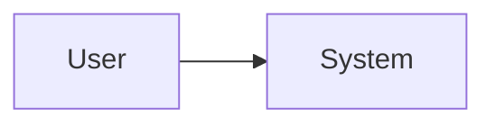

# Architecture

## 1. Architecture goals

- ...

## 2. System context

<Describe users, external systems, trust boundaries and major exchanges.>



## 3. Main components

### Component A

**Responsibility:**  
**Does not own:**  
**Depends on:**  

## 4. Responsibilities and boundaries

- ...

## 5. Key data flows

### Flow 1 – <Name>

```text
Actor
→ Component
→ External system
```

## 6. Data model and ownership

- ...

## 7. Integrations

### <Integration>

**Purpose:**  
**Direction:**  
**Failure handling:**  

## 8. Security architecture

- Authentication:
- Authorization:
- Secrets:
- Sensitive data:
- Validation:
- Logging/audit:

## 9. Deployment model

- Packaging:
- Runtime:
- Database:
- Persistence:
- Reverse proxy/TLS:
- Health:
- Scaling assumptions:

## 10. Observability and operability

- Logs:
- Health:
- Metrics:
- Backup/restore:
- Troubleshooting support:

## 11. Key technology choices

| Choice | Rationale | ADR |
|---|---|---|
| ... | ... | ... |

## 12. Trade-offs and constraints

- ...

## 13. Architecture decisions / ADRs

- None yet.

## 14. Open architecture questions

### Blocking

- None.

### Non-blocking

- None.
